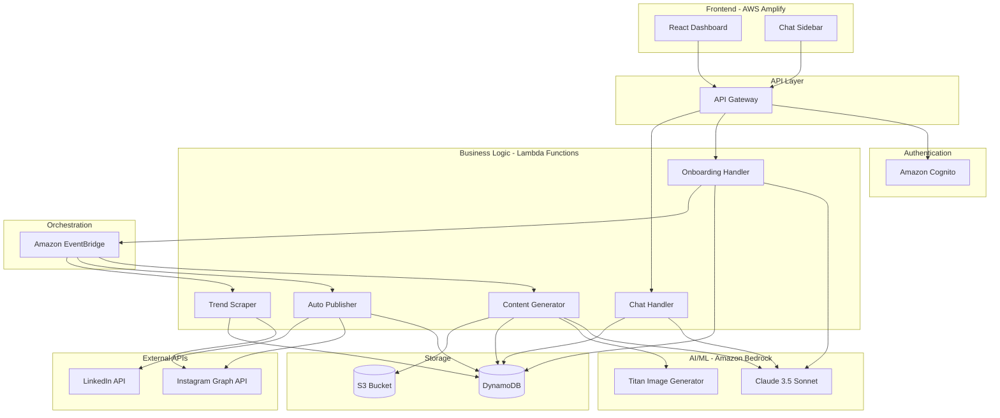
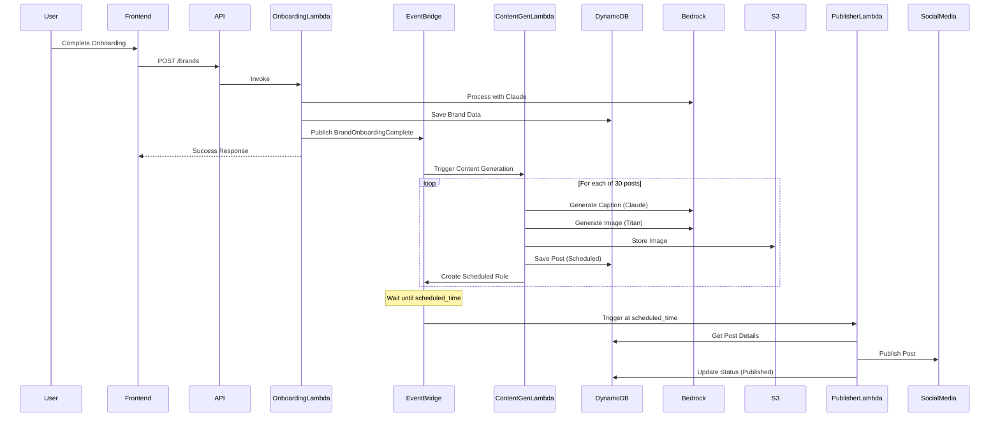

# Design Document: Experta AI Social Media Manager

## Overview

Experta is a serverless, event-driven application built entirely on AWS infrastructure that autonomously manages social media content creation and publishing. The system uses conversational AI (Claude 3.5 Sonnet) for brand onboarding, generative AI (Amazon Titan) for visual content creation, and automated scheduling (EventBridge + Lambda) for hands-free social media management.

The architecture follows a microservices pattern with Lambda functions handling discrete operations, DynamoDB providing persistent storage, and EventBridge orchestrating the autonomous workflow. The frontend is a React application deployed on AWS Amplify that provides both a visual dashboard and conversational interface.

## Architecture

### High-Level Architecture



### Event Flow



## Components and Interfaces

### Frontend Components

#### 1. Dashboard Component
- **Purpose**: Display content calendar and post management interface
- **Technology**: React with Tailwind CSS
- **Key Features**:
  - Calendar view with date-based navigation
  - Post cards with thumbnail, caption preview, status badge
  - Filter by status (Draft, Scheduled, Published, Failed)
  - Click-to-expand post details modal
- **API Integration**: 
  - GET `/api/posts?brand_id={id}&start_date={date}&end_date={date}`
  - GET `/api/posts/{post_id}`

#### 2. Chat Sidebar Component
- **Purpose**: Conversational interface for manual adjustments
- **Technology**: React with real-time message rendering
- **Key Features**:
  - Message history display
  - Text input with send button
  - Typing indicators
  - Action confirmation messages
- **API Integration**:
  - POST `/api/chat` with message payload
  - WebSocket or polling for real-time updates

#### 3. Onboarding Flow Component
- **Purpose**: Multi-step conversational onboarding
- **Technology**: React with state management (Context API or Redux)
- **Key Features**:
  - Chat-style message bubbles
  - Progressive information collection
  - Visual confirmation of collected data
  - Completion celebration screen
- **API Integration**:
  - POST `/api/onboarding/message`
  - POST `/api/brands` (final submission)

#### 4. Authentication Components
- **Purpose**: Login, signup, and session management
- **Technology**: AWS Amplify Auth library with Cognito
- **Key Features**:
  - Email/password login form
  - Sign-up with email verification
  - Password reset flow
  - Protected route wrapper
- **API Integration**: Cognito User Pools via Amplify SDK

### Backend Lambda Functions

#### 1. Onboarding Handler Lambda
- **Trigger**: API Gateway POST `/api/onboarding/message` and POST `/api/brands`
- **Runtime**: Node.js 18.x or Python 3.11
- **Responsibilities**:
  - Process conversational messages via Bedrock (Claude)
  - Validate and structure brand data
  - Save brand to DynamoDB Brands table
  - Encrypt social media credentials
  - Publish BrandOnboardingComplete event to EventBridge
- **Environment Variables**:
  - `BRANDS_TABLE_NAME`
  - `BEDROCK_MODEL_ID` (Claude 3.5 Sonnet)
  - `EVENTBRIDGE_BUS_NAME`
  - `ENCRYPTION_KEY_ID` (KMS key for credentials)
- **IAM Permissions**:
  - DynamoDB: PutItem, GetItem
  - Bedrock: InvokeModel
  - EventBridge: PutEvents
  - KMS: Encrypt, Decrypt

#### 2. Content Generator Lambda
- **Trigger**: EventBridge rule on BrandOnboardingComplete event
- **Runtime**: Python 3.11 (better for AI/ML operations)
- **Responsibilities**:
  - Retrieve brand data from DynamoDB
  - Generate 30 captions using Claude via Bedrock
  - Generate 30 images using Titan via Bedrock
  - Upload images to S3
  - Calculate scheduled times based on post_times
  - Save posts to DynamoDB with "Scheduled" status
  - Create EventBridge scheduled rules for each post
- **Environment Variables**:
  - `BRANDS_TABLE_NAME`
  - `POSTS_TABLE_NAME`
  - `S3_BUCKET_NAME`
  - `BEDROCK_CLAUDE_MODEL_ID`
  - `BEDROCK_TITAN_MODEL_ID`
  - `EVENTBRIDGE_BUS_NAME`
- **IAM Permissions**:
  - DynamoDB: GetItem, PutItem, BatchWriteItem
  - Bedrock: InvokeModel
  - S3: PutObject
  - EventBridge: PutRule, PutTargets
- **Processing Logic**:
  ```
  1. Fetch brand data
  2. For each day (1-30):
     a. Select content_pillar (round-robin distribution)
     b. Generate caption prompt incorporating pillar, tone, trends
     c. Call Bedrock Claude for caption
     d. Generate image prompt incorporating visual_style, pillar
     e. Call Bedrock Titan for image
     f. Upload image to S3
     g. Calculate scheduled_time (day + post_time)
     h. Save post to DynamoDB
     i. Create EventBridge rule for scheduled_time
  3. Publish ContentCalendarGenerated event
  ```

#### 3. Auto Publisher Lambda
- **Trigger**: EventBridge scheduled rules (one per post)
- **Runtime**: Node.js 18.x (better for API integrations)
- **Responsibilities**:
  - Retrieve post details from DynamoDB
  - Decrypt social media credentials
  - Publish to Instagram Graph API
  - Publish to LinkedIn API
  - Update post status to "Published" or "Failed"
  - Log publication results
  - Implement retry logic with exponential backoff
- **Environment Variables**:
  - `POSTS_TABLE_NAME`
  - `BRANDS_TABLE_NAME`
  - `AUTOMATION_LOGS_TABLE_NAME`
  - `ENCRYPTION_KEY_ID`
  - `SNS_TOPIC_ARN` (for failure notifications)
- **IAM Permissions**:
  - DynamoDB: GetItem, UpdateItem, PutItem
  - KMS: Decrypt
  - SNS: Publish
- **Publishing Logic**:
  ```
  1. Get post from DynamoDB
  2. Get brand credentials from DynamoDB
  3. Decrypt credentials using KMS
  4. Download image from S3
  5. If platform == Instagram:
     a. Upload image to Instagram (container creation)
     b. Publish container with caption
  6. If platform == LinkedIn:
     a. Register upload
     b. Upload image
     c. Create post with image and caption
  7. If success:
     a. Update post status to "Published"
     b. Record actual_publish_time
  8. If failure:
     a. Log error
     b. Retry with exponential backoff (max 2 retries)
     c. If all retries fail, update status to "Failed"
     d. Send SNS notification
  ```

#### 4. Chat Handler Lambda
- **Trigger**: API Gateway POST `/api/chat`
- **Runtime**: Python 3.11
- **Responsibilities**:
  - Process user messages via Bedrock (Claude)
  - Interpret user intent (create, modify, delete post)
  - Execute requested actions on DynamoDB
  - Generate new posts if requested
  - Return conversational responses
- **Environment Variables**:
  - `POSTS_TABLE_NAME`
  - `BRANDS_TABLE_NAME`
  - `BEDROCK_CLAUDE_MODEL_ID`
  - `S3_BUCKET_NAME`
  - `BEDROCK_TITAN_MODEL_ID`
- **IAM Permissions**:
  - DynamoDB: GetItem, PutItem, UpdateItem, DeleteItem, Query
  - Bedrock: InvokeModel
  - S3: PutObject
- **Intent Processing**:
  ```
  1. Send user message + conversation history to Claude
  2. Claude returns structured response with:
     - intent: "create_post" | "modify_post" | "delete_post" | "query"
     - parameters: extracted entities
     - response_text: conversational reply
  3. Execute action based on intent:
     - create_post: Generate caption + image, save to DynamoDB
     - modify_post: Update post in DynamoDB
     - delete_post: Delete post from DynamoDB
     - query: Fetch and return information
  4. Return response_text to frontend
  ```

#### 5. Trend Scraper Lambda
- **Trigger**: EventBridge scheduled rule (daily at 2 AM)
- **Runtime**: Python 3.11
- **Responsibilities**:
  - Scrape Instagram trending posts via Graph API
  - Extract style descriptors and themes
  - Store trend data in DynamoDB
  - Maintain rolling 7-day trend window
- **Environment Variables**:
  - `TRENDS_TABLE_NAME`
  - `INSTAGRAM_APP_ID`
  - `INSTAGRAM_APP_SECRET`
- **IAM Permissions**:
  - DynamoDB: PutItem, Query, DeleteItem
  - Secrets Manager: GetSecretValue (for Instagram credentials)

### API Gateway Endpoints

#### Authentication Required Endpoints

| Method | Path | Lambda | Purpose |
|--------|------|--------|---------|
| POST | `/api/brands` | Onboarding Handler | Create new brand |
| GET | `/api/brands/{brand_id}` | Brand Handler | Get brand details |
| GET | `/api/posts` | Posts Handler | List posts with filters |
| GET | `/api/posts/{post_id}` | Posts Handler | Get post details |
| PUT | `/api/posts/{post_id}` | Posts Handler | Update post |
| DELETE | `/api/posts/{post_id}` | Posts Handler | Delete post |
| POST | `/api/chat` | Chat Handler | Send chat message |
| POST | `/api/onboarding/message` | Onboarding Handler | Process onboarding message |

#### Request/Response Schemas

**POST `/api/brands`**
```json
Request:
{
  "brand_name": "string",
  "industry": "string",
  "target_audience": "string",
  "tone_of_voice": "string",
  "visual_style": "string",
  "content_pillars": ["string"],
  "post_times": ["HH:MM"],
  "instagram_token": "string",
  "linkedin_token": "string"
}

Response:
{
  "brand_id": "uuid",
  "message": "Brand created successfully",
  "calendar_generation_started": true
}
```

**GET `/api/posts?brand_id={id}&start_date={date}&end_date={date}&status={status}`**
```json
Response:
{
  "posts": [
    {
      "post_id": "uuid",
      "brand_id": "uuid",
      "caption": "string",
      "image_url": "string",
      "platform": "instagram" | "linkedin",
      "scheduled_time": "ISO8601",
      "status": "Draft" | "Scheduled" | "Published" | "Failed",
      "content_pillar": "string",
      "created_at": "ISO8601",
      "published_at": "ISO8601 | null"
    }
  ],
  "count": "number"
}
```

**POST `/api/chat`**
```json
Request:
{
  "brand_id": "uuid",
  "message": "string",
  "conversation_history": [
    {"role": "user" | "assistant", "content": "string"}
  ]
}

Response:
{
  "response": "string",
  "action_taken": "create_post" | "modify_post" | "delete_post" | "query" | null,
  "affected_post_id": "uuid | null"
}
```

## Data Models

### DynamoDB Tables

#### Brands Table
- **Partition Key**: `brand_id` (String, UUID)
- **Attributes**:
  - `brand_name` (String)
  - `industry` (String)
  - `target_audience` (String)
  - `tone_of_voice` (String)
  - `visual_style` (String)
  - `content_pillars` (List of Strings)
  - `post_times` (List of Strings, format "HH:MM")
  - `user_id` (String, Cognito user ID)
  - `has_instagram_connection` (Boolean, default false)
  - `has_linkedin_connection` (Boolean, default false)
  - `onboarding_session_id` (String, UUID, reference to Onboarding_Sessions)
  - `onboarding_completed_at` (String, ISO8601)
  - `created_at` (String, ISO8601)
  - `updated_at` (String, ISO8601)
- **GSI**: `user_id-index` (Partition Key: `user_id`)
- **Note**: OAuth tokens are NOT stored in this table (moved to Secrets Manager for Phase 2)

#### Posts Table
- **Partition Key**: `post_id` (String, UUID)
- **Attributes**:
  - `brand_id` (String, UUID)
  - `caption` (String)
  - `image_url` (String, S3 URL)
  - `platform` (String, "instagram" | "linkedin")
  - `scheduled_time` (String, ISO8601)
  - `status` (String, "Draft" | "Scheduled" | "Published" | "Failed")
  - `content_pillar` (String)
  - `created_at` (String, ISO8601)
  - `published_at` (String, ISO8601, nullable)
  - `error_message` (String, nullable)
  - `retry_count` (Number, default 0)
- **GSI**: `brand_id-scheduled_time-index` (Partition Key: `brand_id`, Sort Key: `scheduled_time`)
- **GSI**: `brand_id-status-index` (Partition Key: `brand_id`, Sort Key: `status`)

#### Automation_Logs Table
- **Partition Key**: `log_id` (String, UUID)
- **Sort Key**: `timestamp` (String, ISO8601)
- **Attributes**:
  - `brand_id` (String, UUID)
  - `post_id` (String, UUID, nullable)
  - `action` (String, "content_generation" | "post_publish" | "trend_scrape")
  - `status` (String, "success" | "failure")
  - `error_message` (String, nullable)
  - `execution_duration_ms` (Number)
- **GSI**: `brand_id-timestamp-index` (Partition Key: `brand_id`, Sort Key: `timestamp`)
- **TTL**: `ttl` (Number, Unix timestamp, 90 days retention)

#### Trends Table
- **Partition Key**: `trend_id` (String, UUID)
- **Sort Key**: `scraped_at` (String, ISO8601)
- **Attributes**:
  - `source` (String, "instagram" | "web")
  - `style_descriptors` (List of Strings)
  - `themes` (List of Strings)
  - `hashtags` (List of Strings)
  - `engagement_score` (Number)
- **TTL**: `ttl` (Number, Unix timestamp, 7 days retention)

#### Onboarding_Sessions Table (Phase 2)
- **Partition Key**: `session_id` (String, UUID)
- **Sort Key**: `timestamp` (String, ISO8601)
- **Attributes**:
  - `session_id` (String, UUID)
  - `user_id` (String, Cognito user_id)
  - `brand_id` (String, UUID, nullable until created)
  - `conversation_state` (String, e.g., "collecting_name", "collecting_industry")
  - `extracted_data` (Map, JSON of extracted entities)
  - `conversation_history` (List of Maps, [{role, content, timestamp}])
  - `completed_fields` (List of Strings, e.g., ["brand_name", "industry"])
  - `pending_fields` (List of Strings, e.g., ["target_audience", "tone"])
  - `completion_percentage` (Number, 0-100)
  - `last_interaction` (String, ISO8601)
  - `status` (String, "active" | "completed" | "abandoned")
  - `ttl` (Number, Unix timestamp, 7 days for cleanup)
- **GSI**: `user_id-index` (Partition Key: `user_id`)

#### OAuth_Connections Table (Phase 2)
- **Partition Key**: `brand_id` (String, UUID)
- **Sort Key**: `platform` (String, "instagram" | "linkedin")
- **Attributes**:
  - `brand_id` (String, UUID)
  - `platform` (String)
  - `platform_user_id` (String, Instagram user ID or LinkedIn member ID)
  - `platform_username` (String, @handle or profile name)
  - `access_token_secret_arn` (String, ARN to Secrets Manager)
  - `refresh_token_secret_arn` (String, ARN to Secrets Manager, nullable)
  - `token_expires_at` (String, ISO8601, nullable)
  - `scopes_granted` (List of Strings)
  - `connection_status` (String, "active" | "expired" | "revoked")
  - `connected_at` (String, ISO8601)
  - `last_refreshed_at` (String, ISO8601)
  - `profile_data` (Map, {profile_pic, follower_count, etc.})
- **GSI**: `platform-index` (Partition Key: `platform`)

#### Platform_Credentials Table (Phase 2)
- **Partition Key**: `platform` (String, "instagram" | "linkedin")
- **Attributes**:
  - `platform` (String)
  - `app_name` (String)
  - `client_id_secret_arn` (String, ARN to Secrets Manager)
  - `client_secret_arn` (String, ARN to Secrets Manager)
  - `redirect_uri` (String)
  - `scopes` (List of Strings)
  - `is_active` (Boolean)
  - `created_by` (String, admin user_id)
  - `created_at` (String, ISO8601)
  - `updated_at` (String, ISO8601)

### S3 Bucket Structure

```
experta-content-bucket/
├── images/
│   ├── {brand_id}/
│   │   ├── {post_id}.png
│   │   └── ...
└── temp/
    └── {upload_id}.png (temporary uploads, lifecycle policy deletes after 1 day)
```

### Cognito User Pool

- **User Attributes**:
  - `email` (required, used as username)
  - `name` (optional)
  - `custom:brand_id` (custom attribute linking user to brand)
- **Password Policy**:
  - Minimum length: 8 characters
  - Require uppercase, lowercase, numbers, symbols
- **MFA**: Optional (TOTP)
- **Email Verification**: Required

## Correctness Properties


A property is a characteristic or behavior that should hold true across all valid executions of a system—essentially, a formal statement about what the system should do. Properties serve as the bridge between human-readable specifications and machine-verifiable correctness guarantees.

### Property 1: Brand Data Completeness
*For any* brand created through onboarding, the brand record SHALL contain all required fields: brand_name, industry, target_audience, tone_of_voice, visual_style, at least 3 content_pillars, and post_times.
**Validates: Requirements 1.2, 1.3, 1.4, 2.2**

### Property 2: Brand ID Format Validation
*For any* brand created in the system, the brand_id SHALL be a valid UUID format.
**Validates: Requirements 2.5**

### Property 3: Credential Encryption Round-Trip
*For any* social media credentials stored in the system, encrypting then decrypting SHALL return the original credential value.
**Validates: Requirements 2.3, 2.4**

### Property 4: Image Generation Prompt Inclusion
*For any* image generation request, the prompt sent to Amazon Titan SHALL include the brand's visual_style text.
**Validates: Requirements 3.2**

### Property 5: Image Storage Consistency
*For any* generated image, an S3 object SHALL exist with a unique key, and the corresponding post record SHALL contain a valid S3 URL pointing to that object.
**Validates: Requirements 3.3, 3.4**

### Property 6: Image Resolution Requirements
*For any* image generated for Instagram, the image dimensions SHALL be at least 1080x1080 pixels.
**Validates: Requirements 3.6**

### Property 7: Trend Data Persistence
*For any* trend scraping operation, the resulting trend records in DynamoDB SHALL contain style_descriptors and themes fields.
**Validates: Requirements 4.3, 4.4**

### Property 8: Content Calendar Size
*For any* completed content generation operation, exactly 30 post records SHALL be created in DynamoDB.
**Validates: Requirements 5.2**

### Property 9: Post Time Alignment
*For any* post created during content generation, the scheduled_time SHALL align with one of the brand's defined post_times (matching the time component).
**Validates: Requirements 5.3**

### Property 10: Content Pillar Distribution
*For any* set of 30 generated posts, each content_pillar SHALL appear at least once, and the distribution SHALL be balanced (no pillar appears more than 2x any other pillar).
**Validates: Requirements 5.4**

### Property 11: Initial Post Status
*For any* post created during content generation, the initial status SHALL be "Scheduled".
**Validates: Requirements 5.7**

### Property 12: Post Schema Completeness
*For any* post record in DynamoDB, it SHALL contain all required fields: post_id, brand_id, caption, image_url, platform, scheduled_time, status, and content_pillar.
**Validates: Requirements 5.8**

### Property 13: Publication State Management
*For any* post processed by the Auto_Publisher:
- If publication succeeds, status SHALL be "Published" and published_at SHALL be non-null
- If publication fails after all retries, status SHALL be "Failed" and error_message SHALL be non-null
**Validates: Requirements 6.4, 6.5, 6.6**

### Property 14: Dashboard Data Filtering
*For any* API request to fetch posts, the response SHALL only include posts where brand_id matches the authenticated user's associated brand.
**Validates: Requirements 7.6, 9.4**

### Property 15: Post Display Completeness
*For any* post returned by the API, it SHALL contain thumbnail (image_url), caption preview, platform, and scheduled_time fields.
**Validates: Requirements 7.3**

### Property 16: Calendar Sorting
*For any* list of posts returned by the dashboard API, posts SHALL be sorted by scheduled_time in ascending order.
**Validates: Requirements 7.5**

### Property 17: Chat Action Persistence
*For any* chat request with intent "create_post", a new post record SHALL exist in DynamoDB after processing.
*For any* chat request with intent "modify_post", the target post SHALL be updated in DynamoDB after processing.
*For any* chat request with intent "delete_post", the target post SHALL no longer exist in DynamoDB after processing.
**Validates: Requirements 8.3, 8.4, 8.5**

### Property 18: JWT Token Validation
*For any* API request with an invalid or missing JWT token, the response SHALL have HTTP status 401 or 403.
**Validates: Requirements 9.5**

### Property 19: EventBridge Cron Expression Accuracy
*For any* EventBridge scheduled rule created for a post, the cron expression SHALL match the post's scheduled_time.
**Validates: Requirements 10.6**

### Property 20: Lambda Execution Logging
*For any* Lambda function execution, at least one log entry SHALL exist in CloudWatch Logs with execution details.
**Validates: Requirements 11.1**

### Property 21: Error Log Completeness
*For any* error logged by the system, the log entry SHALL contain error_message, stack trace, and context information.
**Validates: Requirements 11.2**

### Property 22: Automation Log Schema
*For any* automation log entry in DynamoDB, it SHALL contain all required fields: log_id, brand_id, action, status, and timestamp.
**Validates: Requirements 11.4**

### Property 23: HTTPS Enforcement
*For any* API call made by the frontend, the URL SHALL use the HTTPS protocol.
**Validates: Requirements 12.5**

### Property 24: API Request Validation
*For any* API request with an invalid payload (missing required fields or wrong types), the response SHALL have HTTP status 400 and include a descriptive error message.
**Validates: Requirements 13.4, 13.5**

### Property 25: Post Regeneration Invariants
*For any* post regeneration operation, the scheduled_time and content_pillar SHALL remain unchanged from the original post.
**Validates: Requirements 14.2**

### Property 26: Post Edit Status Preservation
*For any* post edit operation that does not explicitly change status, the status field SHALL remain unchanged.
**Validates: Requirements 14.4**

### Property 27: EventBridge Rule Preservation
*For any* post edit operation on a scheduled post, the corresponding EventBridge rule SHALL still exist after the edit.
**Validates: Requirements 14.5**

### Property 28: Platform Selection Validation
*For any* post creation request, the platform field SHALL be one of: "instagram", "linkedin", or both.
**Validates: Requirements 15.1**

### Property 29: Multi-Platform Post Creation
*For any* post creation request targeting multiple platforms, separate post records SHALL be created for each platform, each with the same caption and scheduled_time.
**Validates: Requirements 15.2, 15.5**

### Property 30: Platform-Specific Formatting
*For any* post published to Instagram, the content SHALL meet Instagram's formatting requirements (caption length, image format).
*For any* post published to LinkedIn, the content SHALL meet LinkedIn's formatting requirements (caption length, image format).
**Validates: Requirements 15.3, 15.4**

### Property 31: OAuth Token Storage Security (Phase 2)
*For any* OAuth connection created, the access token SHALL be stored in AWS Secrets Manager (not DynamoDB), and the OAuth_Connections record SHALL contain only the Secrets Manager ARN.
**Validates: Requirements 16.4, 16.5**

### Property 32: Connection Status Synchronization (Phase 2)
*For any* OAuth connection established, the corresponding brand record SHALL have the appropriate connection flag (has_instagram_connection or has_linkedin_connection) set to true.
**Validates: Requirements 16.6**

### Property 33: Token Visibility Restriction (Phase 2)
*For any* API response containing OAuth connection data, the response SHALL NOT include raw access tokens or refresh tokens.
**Validates: Requirements 16.9**

### Property 34: Multi-Entity Extraction (Phase 2)
*For any* onboarding message containing multiple brand attributes, the AI entity extraction SHALL identify and extract all present entities simultaneously.
**Validates: Requirements 17.1, 17.2**

### Property 35: Session State Persistence (Phase 2)
*For any* onboarding session update, the conversation_history and extracted_data SHALL be persisted to DynamoDB before returning a response.
**Validates: Requirements 18.2, 18.3**

### Property 36: Session Completion Percentage (Phase 2)
*For any* onboarding session, the completion_percentage SHALL accurately reflect the ratio of completed_fields to total required fields (0-100).
**Validates: Requirements 17.6**

### Property 37: Admin Authorization Enforcement (Phase 2)
*For any* request to admin endpoints, the system SHALL verify the user belongs to the Cognito admin group before processing.
**Validates: Requirements 19.1**

### Property 38: Platform Credentials Encryption (Phase 2)
*For any* platform OAuth credentials saved by admin, the client_id and client_secret SHALL be stored in Secrets Manager with KMS encryption, not in DynamoDB.
**Validates: Requirements 19.2, 19.3**

### Property 39: Onboarding Token Exclusion (Phase 2)
*For any* brand created through onboarding, the brand record SHALL NOT contain instagram_token_encrypted or linkedin_token_encrypted fields.
**Validates: Requirements 1.9, 2.3**

### Property 40: Onboarding Redirect Behavior (Phase 2)
*For any* completed onboarding session, the system SHALL redirect the user to the Connect Accounts page (not the dashboard).
**Validates: Requirements 1.8**

## Error Handling

### Lambda Function Error Handling

All Lambda functions SHALL implement consistent error handling:

1. **Try-Catch Blocks**: Wrap all business logic in try-catch blocks
2. **Error Logging**: Log all errors with context to CloudWatch
3. **Error Responses**: Return structured error responses with appropriate HTTP status codes
4. **Partial Failure Handling**: For batch operations (content generation), continue processing remaining items if one fails

### API Gateway Error Responses

Standard error response format:
```json
{
  "error": {
    "code": "ERROR_CODE",
    "message": "Human-readable error message",
    "details": {
      "field": "Additional context"
    }
  }
}
```

Error codes:
- `VALIDATION_ERROR` (400): Invalid request payload
- `UNAUTHORIZED` (401): Missing or invalid authentication
- `FORBIDDEN` (403): Insufficient permissions
- `NOT_FOUND` (404): Resource does not exist
- `RATE_LIMIT_EXCEEDED` (429): Too many requests
- `INTERNAL_ERROR` (500): Unexpected server error
- `SERVICE_UNAVAILABLE` (503): Downstream service failure

### Retry Logic

**Content Generation Lambda**:
- Bedrock API calls: 3 retries with exponential backoff (1s, 2s, 4s)
- S3 uploads: 3 retries with exponential backoff
- DynamoDB writes: 3 retries with exponential backoff

**Auto Publisher Lambda**:
- Social media API calls: 2 retries with exponential backoff (5s, 15s)
- On final failure: Update post status to "Failed" and send SNS notification

**Chat Handler Lambda**:
- Bedrock API calls: 2 retries with exponential backoff
- On failure: Return error message to user

### Circuit Breaker Pattern

For external API calls (Instagram, LinkedIn), implement circuit breaker:
- **Closed State**: Normal operation
- **Open State**: After 5 consecutive failures, stop making calls for 60 seconds
- **Half-Open State**: After 60 seconds, allow one test call
- If test succeeds, return to Closed; if fails, return to Open

### Dead Letter Queues

EventBridge rules SHALL configure DLQs for failed Lambda invocations:
- Failed events sent to SQS DLQ
- CloudWatch alarm triggers on DLQ depth > 0
- Manual review and reprocessing workflow

## Testing Strategy

### Dual Testing Approach

The system SHALL be validated using both unit tests and property-based tests:

**Unit Tests**:
- Verify specific examples and edge cases
- Test integration points between components
- Validate error conditions and boundary cases
- Focus on concrete scenarios with known inputs/outputs

**Property-Based Tests**:
- Verify universal properties across all inputs
- Use randomized input generation for comprehensive coverage
- Run minimum 100 iterations per property test
- Focus on invariants, round-trips, and metamorphic properties

Both testing approaches are complementary and necessary for comprehensive coverage. Unit tests catch concrete bugs in specific scenarios, while property tests verify general correctness across the input space.

### Property-Based Testing Configuration

**Testing Library**: Use `fast-check` for JavaScript/TypeScript Lambda functions, `hypothesis` for Python Lambda functions

**Test Configuration**:
- Minimum 100 iterations per property test
- Seed randomization for reproducibility
- Shrinking enabled to find minimal failing examples

**Test Tagging**:
Each property-based test MUST include a comment tag referencing the design property:
```javascript
// Feature: experta-ai-social-manager, Property 1: Brand Data Completeness
test('brand records contain all required fields', () => {
  fc.assert(fc.property(brandGenerator(), (brand) => {
    expect(brand).toHaveProperty('brand_name');
    expect(brand).toHaveProperty('industry');
    // ... additional assertions
  }), { numRuns: 100 });
});
```

### Test Coverage by Component

#### Onboarding Handler Lambda
**Unit Tests**:
- Test successful brand creation with valid data
- Test validation errors for missing required fields
- Test encryption of social media credentials
- Test EventBridge event publishing

**Property Tests**:
- Property 1: Brand Data Completeness
- Property 2: Brand ID Format Validation
- Property 3: Credential Encryption Round-Trip

#### Content Generator Lambda
**Unit Tests**:
- Test content generation for single brand
- Test Bedrock API error handling
- Test S3 upload failures
- Test EventBridge rule creation

**Property Tests**:
- Property 4: Image Generation Prompt Inclusion
- Property 5: Image Storage Consistency
- Property 6: Image Resolution Requirements
- Property 8: Content Calendar Size
- Property 9: Post Time Alignment
- Property 10: Content Pillar Distribution
- Property 11: Initial Post Status
- Property 12: Post Schema Completeness

#### Auto Publisher Lambda
**Unit Tests**:
- Test successful Instagram publication
- Test successful LinkedIn publication
- Test retry logic on API failures
- Test SNS notification on final failure

**Property Tests**:
- Property 13: Publication State Management
- Property 30: Platform-Specific Formatting

#### Chat Handler Lambda
**Unit Tests**:
- Test create post intent handling
- Test modify post intent handling
- Test delete post intent handling
- Test query intent handling

**Property Tests**:
- Property 17: Chat Action Persistence

#### API Gateway Integration
**Unit Tests**:
- Test authentication enforcement
- Test CORS headers
- Test request routing to correct Lambdas

**Property Tests**:
- Property 18: JWT Token Validation
- Property 23: HTTPS Enforcement
- Property 24: API Request Validation

#### Dashboard API
**Unit Tests**:
- Test post filtering by date range
- Test post filtering by status
- Test pagination

**Property Tests**:
- Property 14: Dashboard Data Filtering
- Property 15: Post Display Completeness
- Property 16: Calendar Sorting

### Integration Testing

**End-to-End Flows**:
1. Complete onboarding → Content generation → Post publishing
2. Chat request → Post creation → Dashboard update
3. Post regeneration → EventBridge rule update
4. Multi-platform post → Simultaneous publishing

**Infrastructure Testing**:
- Use AWS SAM or CDK for local testing
- Mock external APIs (Instagram, LinkedIn) in test environment
- Use DynamoDB Local for database testing
- Use LocalStack for AWS service mocking

### Performance Testing

**Load Testing**:
- Simulate 100 concurrent onboarding sessions
- Test content generation for 50 brands simultaneously
- Test 1000 posts published within 1-hour window

**Latency Requirements**:
- API Gateway response time: < 200ms (excluding Lambda cold starts)
- Content generation: < 5 minutes for 30 posts
- Post publishing: < 10 seconds per post

### Security Testing

**Authentication Testing**:
- Test JWT token expiration
- Test token tampering detection
- Test unauthorized access attempts

**Authorization Testing**:
- Test cross-brand data access prevention
- Test API endpoint permission enforcement

**Data Protection Testing**:
- Verify credential encryption at rest
- Verify HTTPS enforcement
- Verify no sensitive data in logs
